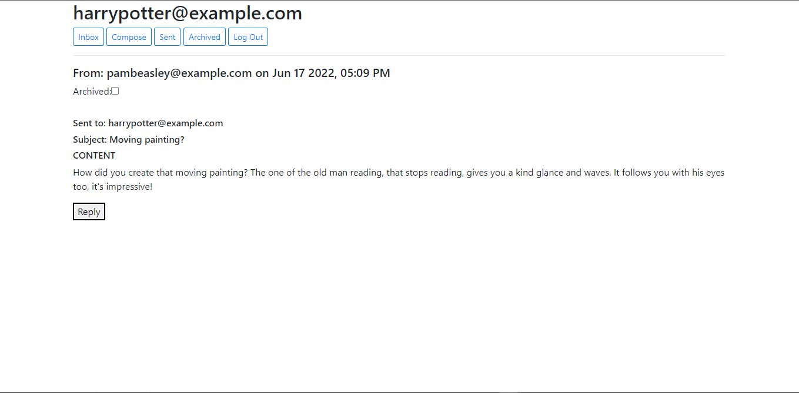
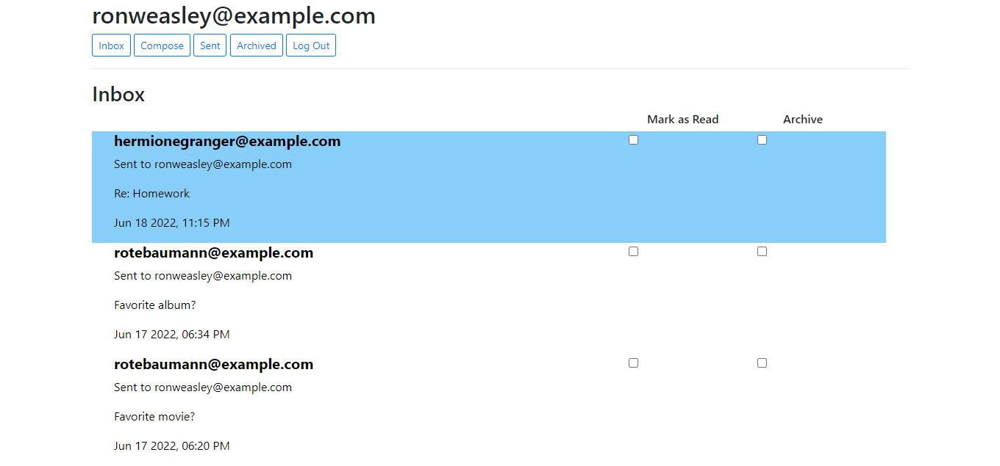
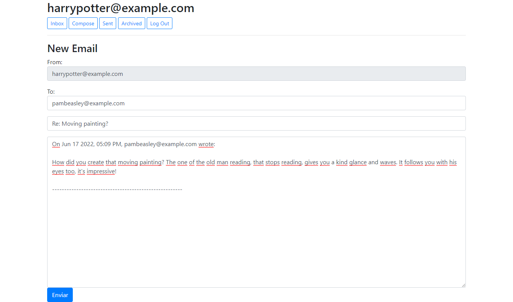
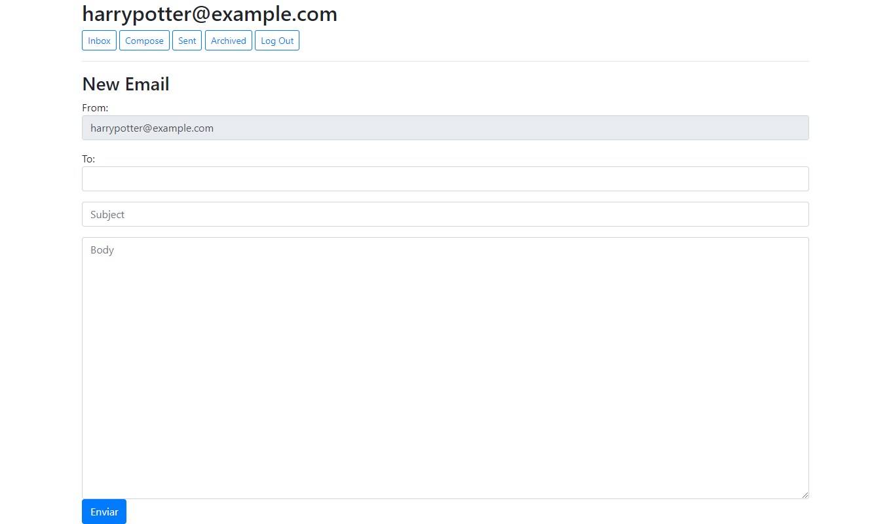
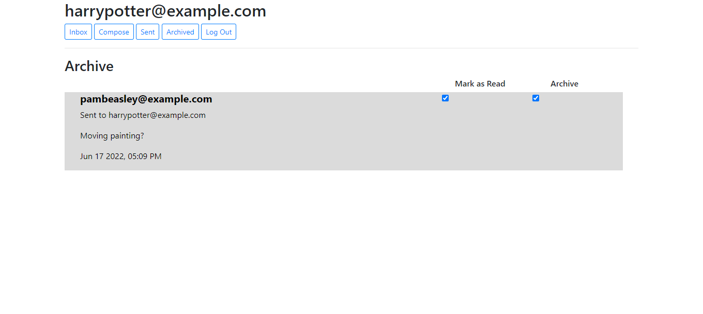

## Mail

[Check the main repo](https://github.com/JorgeEncinas/CS50-Web-Compiled)

This project requires working only on the Frontend with pure JavaScript. It's, as the name suggests, a mail system.
 You can send, read, reply, and archive/unarchive mail, all without reloading the page, as it's all made using fetch calls.
  The Backend was already written; it was up to me to use it and display content accordingly.

[Project Requirements specified here](https://cs50.harvard.edu/web/2020/projects/3/mail/)

### Images

There are 2 additional screenshots in the folder, but I didn't find them too informative, so I left only these ones.
